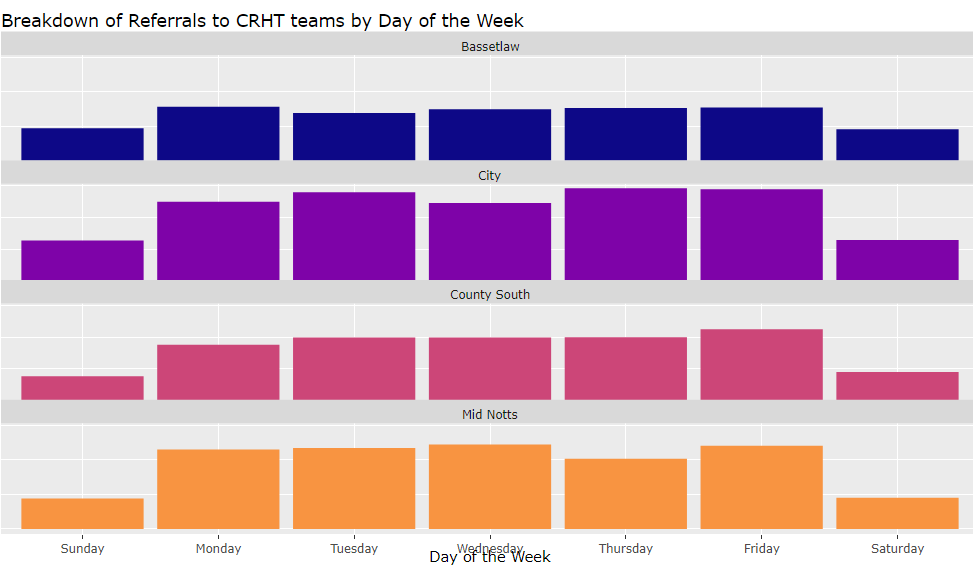
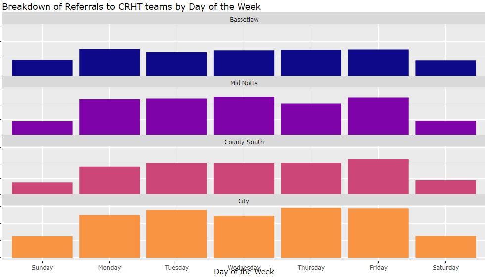

```{r setup, include=FALSE}
knitr::opts_chunk$set(echo = FALSE)
```

Typically, when organising teams onto a graphs/tables and other formats they default to alphabetical. However, during a recent Understanding Your Data meeting we discussed was this the most useful way to present data.

Within Nottinghamshire we have the geography broken down into 4 key areas. From north to south we have Bassetlaw, Mid Notts, County South and City. When sorted alphabetically they would be Bassetlaw, City, County South and Mid Notts. The Crisis Resolution, Home Treatment (CRHT) teams map directly to these localities. When creating graphs and tables they would have been alphabetical. As seen in the graph below it can show a large discrepancy between Bassetlaw and City (Numbers removed from y-axis for public showing). When the reality is that the two populations are as different as can be within Nottinghamshire. Bassetlaw is very rural and less deprived compared to Nottingham.


 
This then triggered the consideration about the most appropriate way to order the teams. As the teams are most like each other are those that are geographically neighbouring. While there are still differences between each geography it allows for some consideration between them. When organised differently the large difference between Bassetlaw and City is less distracting and allows for them to be assessed more truly.



It was discussed in the meeting and the view from the clinicians’ present, as well as other members of the group, is that this did fit more logically to how they associate the teams. For CRHT City and County South are co-located in the same physical location so are often thought of together, Mid Nottinghamshire and Bassetlaw share a service manager as well as offering support out of hours for each other. Since this discussion it has been discussed with other areas such as older adult community teams who preferred the geographical ordering. Within Mid Nottinghamshire there are 2 older adult teams. "Ashfield & Mansfield" and "Newark & Sherwood", when ordered with the other 5 community teams they were top and bottom of the list making it hard to compare them when they are the teams expected to be most similar to each other. Bassetlaw and Nottingham City were again placed next to each other in the ordering alphabetically causing them to see very different, even though a lot of the difference is commonly relating to the difference in population rather than team performance.

